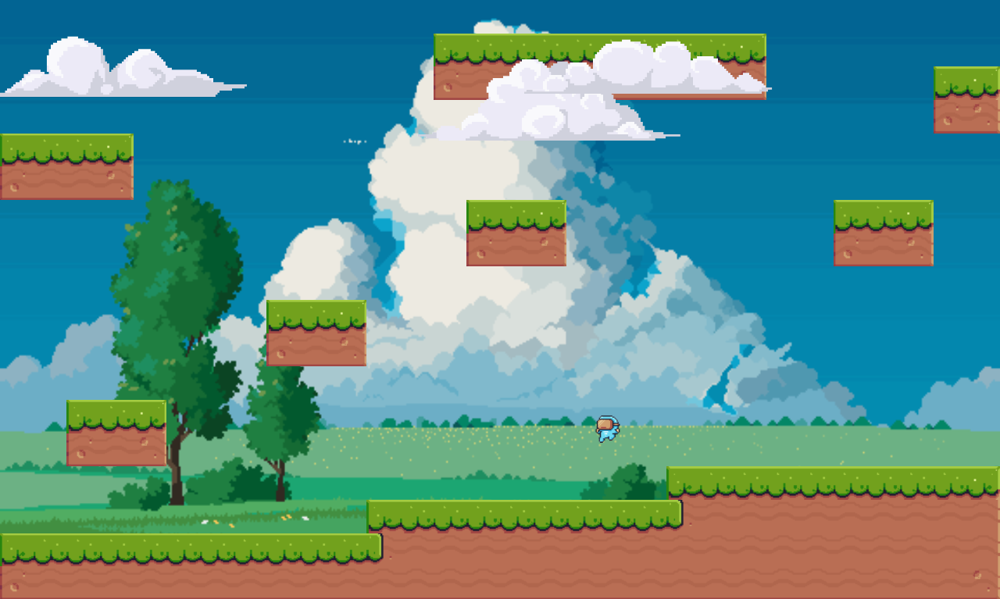

<h2 id="meet_the_team">
&nbsp;<b>Platformer 🎮</b>
 </h2> 

A simple game I made 😙 with ❤ using C++

> [!NOTE]
>  Bugs are expected 😉. This is in early stages of development.
> If you encounter any serious bug please report it 😅.

## Demo


## Features 😎 

This will be my first platformer game. It will have features people take for granted like:

- [x] Controlable Character
- [x] Movements
    - [x] Run
    - [x] Walk 
    - [x] ~Crouch~
    - [x] Jump
- [x] ~Attacks~ (I support peece)
    - [x] ~Mele~
    - [x] ~Dash~
    - [x] ~Block~
- [x] Physics System (Box2D-v3)
- [x] Animations
- [x] ~Enemy AI~ (I said I love pieas)
- [x] Level System (Not the best rn. Can improve on it)
- [x] Music
    - [x] Background Music
    - [x] Player Music


<h2 id="Overview">
 <b> Dependencies</b>
</h2>

- Fetched:
    - [GLEW](https://glew.sourceforge.net/) 
    - [Box2D](https://box2d.org/)
    - [GLM](https://github.com/g-truc/glm)
    - [SDL2](https://www.libsdl.org/) -- It is fetched but is recommended to have it in your system pre-installed, otherwise too it'll work (I hope. I mean it should)
- Included:
    - [stb_image.h](https://github.com/nothings/stb)
    - [miniaudio.h](https://miniaud.io/)
- Needed: (Users need it by default)
    - [OpenGL-v2.1+](https://www.opengl.org/)
- Others:
    - [Catch2](https://github.com/catchorg/Catch2) -- For unit tests (There are none, I just wanted to know how they work. But didn't know when to make them so I have no unit tests. But I have support for them)

<h2>
    Controls 
</h2>

| Input              | Control         |
| --------------     | --------------- |
| 'a' or Left        | Left            |
| 'd' or Right       | Right           |
| Space              | Jump            |
| Space while in air | DoubleJump      |


<h2>
    Installation 
</h2>

#### Download from github [releases](https://github.com/AnkushRoy-code/Platformer/releases/latest):
Download the archive from releases section according to your OS and extract it. 
Open a terminal inside the directory and run this command:
`./bin/PlatformerExe`

>[!NOTE]
>If you run the executable from anywhere other than the root of the extracted directory you will not be able to load any of the assets (Images and sound files)

#### Compile it:

Install required dependency:
```bash
sudo apt-get update && sudo apt-get install -y libgl1-mesa-dev libglu1-mesa-dev freeglut3-dev # In Mac you can use brew to install `brew install freeglut`
```

Clone the repo: 

Either download the repo ZIP or clone and change to that directory by running this command:
```bash
git clone https://github.com/AnkushRoy-code/Platformer
cd Platformer
```

Configure CMake:
```bash
cmake -B $build -DCMAKE_BUILD_TYPE=Release -DENABLE_TESTING="OFF"
```

Compile:
```bash
cmake --build build --config Release
```
Executable is present in `src/main/` inside the build directory with the name `PlatformerExe`
You can run that using this command:
```bash
./src/main/PlatformerExe
```

>[!NOTE]
>If you run the executable from anywhere other than the root of the build directory you will not be able to load any of the assets (Images and sound files) present in the `res` directory


I hope yours too looks like mine :)

And there you have it, everything I have to offer using my project! I hope you liked it 😄. And if you did please star my repo it gives me motivation to keep on imporving 🙃.


## To-Do 🛠️
- Add Level system
- Add menu & save game state
- Add enemies 🤫
- Make the player customizeable

## Known bugs 🐞
- Holding the space button does something weird 😵‍😵‍💫
- The player sometimes can float in the corner of the ground


## Contributing 🤝
Everyone is welcome to contribute to the code!
You can also raise an issue, or suggest any features that you think would be great :)


## License 🛡️
This project is licensed under the [MIT](https://choosealicense.com/licenses/mit/)
